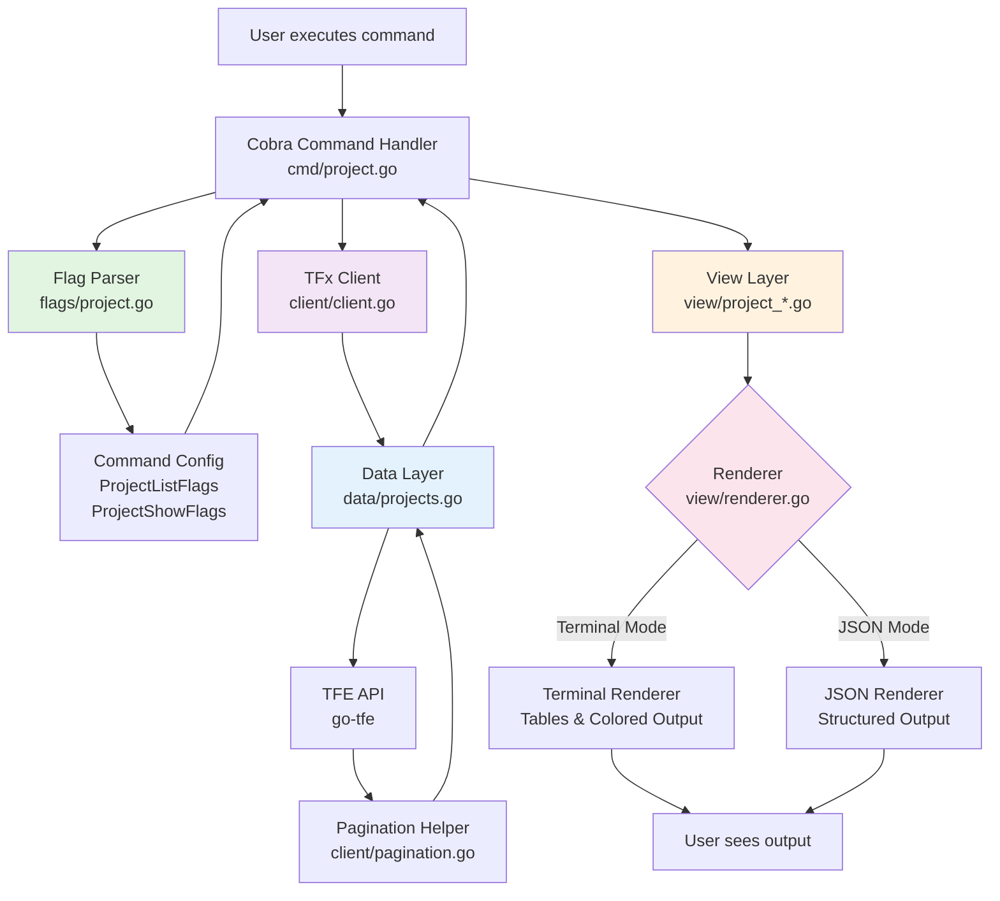

# Code Refactoring: Project Commands

This document outlines the refactored architecture for `tfx project list` and `tfx project show` commands, demonstrating a clean separation of concerns and improved maintainability.

## Overview

The refactor introduces a layered architecture that separates:

- **Command orchestration** (cmd package)
- **Flag parsing** (flags package)  
- **API data fetching** (data package)
- **Client abstraction** (client package)
- **Output rendering** (view package)

## Architecture Flow



## Package Responsibilities

### 1. **flags** Package

**Purpose:** Parse and validate command-line flags into structured configuration objects

```go
// Clean, typed configuration
type ProjectListFlags struct {
    Search string
    All    bool
}

type ProjectShowFlags struct {
    ID   string
    Name string
}
```

**Benefits:**

- Type-safe flag access (no string keys)
- Single source of truth for flag parsing
- Easy to test flag validation logic
- Reusable across commands

### 2. **client** Package  

**Purpose:** Provide a unified TFE client with context and organization awareness

```go
type TfxClient struct {
    Client           *tfe.Client
    Context          context.Context
    Hostname         string
    OrganizationName string
}
```

**Key Features:**

- **Generic pagination helper** - `FetchAll[T]()` works with any TFE API endpoint
- Context propagation for cancellation
- Centralized client configuration
- Optional HTTP request/response logging

**Benefits:**

- DRY principle - pagination logic written once
- Type-safe generic implementation
- Easier to add new API calls
- Consistent error handling

### 3. **data** Package

**Purpose:** Handle all API interactions and business logic for data fetching

```go
// Clear, focused functions
func FetchProjects(c *client.TfxClient, orgName, searchString string) ([]*tfe.Project, error)
func FetchProjectsAcrossOrgs(c *client.TfxClient, searchString string) ([]*tfe.Project, error)  
func FetchProject(c *client.TfxClient, projectID string, options *tfe.ProjectReadOptions) (*tfe.Project, error)
func FetchProjectByName(c *client.TfxClient, orgName, projectName string, options *tfe.ProjectReadOptions) (*tfe.Project, error)
```

**Benefits:**

- Single responsibility - only fetches data
- Automatic pagination handling via client helpers
- Reusable across multiple commands
- Easy to mock for testing
- Business logic (e.g., name-based lookup) isolated here

### 4. **view** Package

**Purpose:** Handle all output rendering with format-agnostic interface

**Architecture:**

```
BaseView (common functionality)
    ├── ProjectListView
    └── ProjectShowView
    
Renderer Interface
    ├── TerminalRenderer (tables, colors, formatting)
    └── JSONRenderer (structured JSON output)
```

**Benefits:**

- **Dual output modes** - Terminal (human-readable) and JSON (machine-readable)
- Views decide *what* to show, renderers decide *how* to show it
- Consistent output formatting across all commands
- Easy to add new output formats (CSV, YAML, etc.)
- Testable rendering logic

### 5. **cmd** Package

**Purpose:** Orchestrate the command flow

**Simplified Flow:**

1. Parse flags into config object
2. Create client
3. Fetch data via data layer
4. Render output via view layer

```go
func projectList(cmdConfig *flags.ProjectListFlags) error {
    c, _ := client.NewFromViper()                                      // 1. Get client
    projects, _ := data.FetchProjects(c, c.OrganizationName, cmdConfig.Search)  // 2. Fetch data
    
    view := view.NewProjectListView(viper.GetBool("json"))            // 3. Create view
    return view.Render(c.OrganizationName, projects)                   // 4. Render
}
```

## Code Flow Examples

### tfx project list

```
┌─────────────────────────────────────────────┐
│ 1. User runs: tfx project list --search foo │
└─────────────────────────────────────────────┘
                    ↓
┌─────────────────────────────────────────────┐
│ 2. Cobra invokes projectListCmd.RunE        │
└─────────────────────────────────────────────┘
                    ↓
┌─────────────────────────────────────────────┐
│ 3. flags.ParseProjectListFlags()            │
│    → Returns: &ProjectListFlags{            │
│        Search: "foo", All: false            │
│      }                                      │
└─────────────────────────────────────────────┘
                    ↓
┌─────────────────────────────────────────────┐
│ 4. client.NewFromViper()                    │
│    → Returns configured TfxClient           │
└─────────────────────────────────────────────┘
                    ↓
┌─────────────────────────────────────────────┐
│ 5. data.FetchProjects(client, org, "foo")   │
│    → Uses client.FetchAll() for pagination  │
│    → Returns []*tfe.Project                 │
└─────────────────────────────────────────────┘
                    ↓
┌─────────────────────────────────────────────┐
│ 6. view.NewProjectListView(isJSON)          │
│    → Creates view with appropriate renderer │
└─────────────────────────────────────────────┘
                    ↓
┌─────────────────────────────────────────────┐
│ 7. view.Render(orgName, projects)           │
│    → Renders table (terminal) or JSON       │
└─────────────────────────────────────────────┘
```

### tfx project show --name myproject

```
┌──────────────────────────────────────────────────┐
│ 1. User runs: tfx project show --name myproject  │
└──────────────────────────────────────────────────┘
                    ↓
┌──────────────────────────────────────────────────┐
│ 2. Cobra invokes projectShowCmd.RunE             │
└──────────────────────────────────────────────────┘
                    ↓
┌──────────────────────────────────────────────────┐
│ 3. flags.ParseProjectShowFlags()                 │
│    → Returns: &ProjectShowFlags{                 │
│        Name: "myproject", ID: ""                 │
│      }                                           │
└──────────────────────────────────────────────────┘
                    ↓
┌──────────────────────────────────────────────────┐
│ 4. client.NewFromViper()                         │
│    → Returns configured TfxClient                │
└──────────────────────────────────────────────────┘
                    ↓
┌──────────────────────────────────────────────────┐
│ 5. data.FetchProjectByName(client, org, name)    │
│    → Searches projects, finds exact match        │
│    → Fetches full details with ReadWithOptions   │
│    → Returns *tfe.Project                        │
└──────────────────────────────────────────────────┘
                    ↓
┌──────────────────────────────────────────────────┐
│ 6. view.NewProjectShowView(isJSON)               │
│    → Creates view with appropriate renderer      │
└──────────────────────────────────────────────────┘
                    ↓
┌──────────────────────────────────────────────────┐
│ 7. view.Render(orgName, project)                 │
│    → Renders fields (terminal) or JSON object    │
└──────────────────────────────────────────────────┘
```

## Key Benefits of This Refactor

### 1. **Separation of Concerns**

- Each package has ONE clear responsibility
- No mixing of API logic, rendering, and orchestration
- Easy to understand where to make changes

### 2. **Testability**

- Each layer can be tested independently
- Mock data layer for view tests
- Mock client for data layer tests
- No need for complex integration tests

### 3. **Reusability**

- `FetchProjects()` can be used by any command
- Pagination helper works with any API endpoint
- Renderers shared across all commands
- Flag parsing patterns consistent

### 4. **Maintainability**

- Adding new commands follows established patterns
- Output format changes happen in one place
- API changes isolated to data layer
- Easy onboarding for new developers

### 5. **Flexibility**

- Switch output formats with one flag (`--json`)
- Add new renderers (CSV, YAML) without touching commands
- Extend data fetching without changing views
- Support new API options easily

### 6. **Type Safety**

- Strongly typed flag configurations
- Generic pagination eliminates casting
- Compile-time checks for data structures

### 7. **DRY Principle**

- Pagination written once, used everywhere
- Rendering logic not repeated per command
- Client configuration centralized
- Flag patterns reusable

## Example: Adding a New Command

To add `tfx project create`, you would:

1. **flags/project.go** - Add `ProjectCreateFlags` struct and parser
2. **data/projects.go** - Add `CreateProject()` function
3. **view/project_create.go** - Add view to render creation result
4. **cmd/project.go** - Wire it all together in ~15 lines

No need to reinvent pagination, rendering, or client setup!

## Comparison: Before vs After

### Before (Old Style)

```go
// Everything mixed together in cmd file
func projectList(cmd *cobra.Command) error {
    // Flag parsing inline
    search, _ := cmd.Flags().GetString("search")
    
    // Client creation inline
    client, _ := tfe.NewClient(config)
    
    // API calls with manual pagination
    pageNum := 1
    var allProjects []*tfe.Project
    for {
        result, _ := client.Projects.List(ctx, org, &opts)
        allProjects = append(allProjects, result.Items...)
        if pageNum >= result.TotalPages { break }
        pageNum++
    }
    
    // Rendering inline
    if json {
        json.Marshal(allProjects)
    } else {
        // Table printing code...
    }
}
```

### After (Refactored)

```go
func projectList(cmdConfig *flags.ProjectListFlags) error {
    c, _ := client.NewFromViper()
    projects, _ := data.FetchProjects(c, c.OrganizationName, cmdConfig.Search)
    
    view := view.NewProjectListView(viper.GetBool("json"))
    return view.Render(c.OrganizationName, projects)
}
```

**Result:** 90% less code, infinitely more maintainable!

## Conclusion

This refactoring transforms a monolithic command structure into a clean, layered architecture. Each component does one thing well, making the codebase:

- **Easier to understand** - Clear separation of concerns
- **Easier to test** - Isolated, mockable components  
- **Easier to extend** - Reusable patterns and helpers
- **Easier to maintain** - Changes isolated to appropriate layers

The investment in this structure pays dividends with every new command added, making development faster and reducing bugs.
