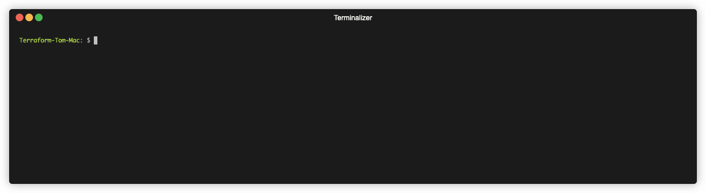

# Why TFx?

If you are asking why does this CLI exist, read on...

As a consumer of HCP Terraform or Terraform Enterprise I want to leverage the full capabilities without having to write curl/python/(insert other) libraries to call the API.

Often times these tasks are part of a delivery pipeline, but could also be administrative tasks that are done from a local machine.
The goal of this tool is to allow users to interact with the platform easily without having to create a lot of code to maintain.

**Common API-Driven Workflow Challenges:**

The initial use case for _tfx_ was to bridge the gap from the [CLI-Workflow](https://www.terraform.io/cloud-docs/run/cli) and the [API-Driven Workflow](https://www.terraform.io/cloud-docs/run/api).

- The CLI-Driven workflow presents several challenges when creating more advanced pipelines for a Workspace run, specifically the inability to insert a gate check between a plan and apply, (in other words you must run a `terraform apply -auto-approve`).
- The CLI driven workflow requires a `terraform init` that forces a download of providers before a plan can be called remotely, these providers are never actually used on the local host and can be difficult to source airgapped environments.
- Implementing an API-Driven workflow requires several API calls to perform a plan/apply.
- It is unlikely that the full range of features will be built into [Terraform](https://github.com/hashicorp/terraform).
- Developing CI/CD specific plugins for even the most common tools is not feasible, and ignores the ability to run the commands locally.

